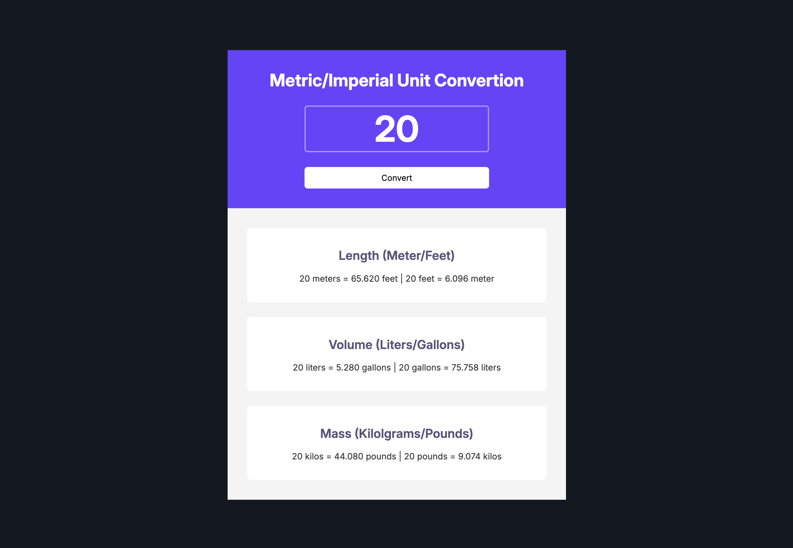

<b><b>Overview</b>  </b>  
The Metric/Imperial Unit Converter is a simple tool for converting between metric and imperial units. It supports conversions for Length, Volume, and Mass.

<b>Features</b> 
Length: Convert between meters and feet. 
Volume: Convert between liters and gallons. 
Mass: Convert between kilograms and pounds. 
Easy-to-Use: Enter a value, hit "Convert," and see results instantly.
